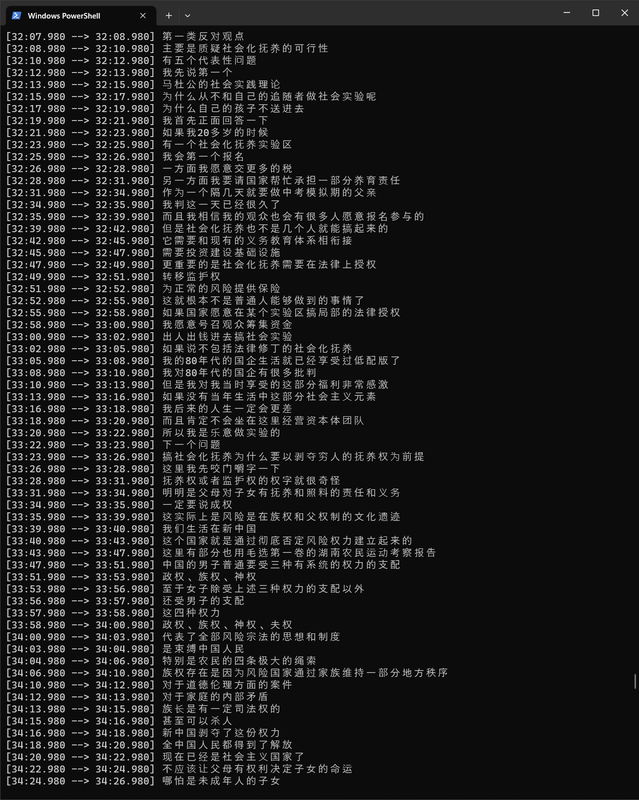

# Web_Video2Text
## Now supports videos on both Youtube and BiliBili 
Input a video web page url, transcribe the video without downloading it.

* Uses *Speechmatics* to transcribe audio files from online urls. To make it work, one have to register an account and generate an API key. So far this is free. 

* For Youtube videos, *yt-dlp* is used to fetch video urls. More on https://github.com/yt-dlp/yt-dlp. 

* For b站视频, Url parsing code is from https://www.bilibili.com/video/BV1LX4y1u7VA/?spm_id_from=333.880.my_history.page.click. and https://cloud.tencent.com/developer/article/1768680.
It only supports parsing videos from *BiliBili*. Some amendments are made to the original code since BiliBili changed their web code. 

### Preparation
在*Speechmatics*官网注册并免费生成API key， 复制在'AUTH_TOKEN'，可以选择调整语言:
```python
AUTH_TOKEN = 'Get your token from https://portal.speechmatics.com/home/'
LANGUAGE = "cmn"
```
Language can be changed. Check https://docs.speechmatics.com/on-prem/container/lang-id-container for supported languages. 
<br>

**For Youtube**

Get *yt-dlp* from https://github.com/yt-dlp/yt-dlp. Guides for installation could be found on the same page, no more operation needed.
This is only for fetching Youtube video urls. 
<br>

**For BiliBili**

在视频网页，查看网页代码F12 -> Network -> Name 并复制'user_agent'到'headers':
```python
headers = {
    'user-agent': 'copy your user-agent here'}
```
以上步骤只需要进行一次。

完成后直接运行并输入视频网址:
```
python video2text_public.py
video_url: 'your url'
```

The transcription will appear in terminal.

